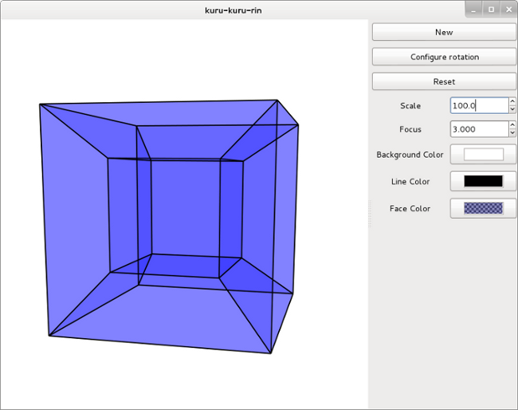

くるくるりん
==========

n (3 <= n <= 10) 次元ユークリッド空間中の超立方体(hypercube)をインタラクティブに回転させるソフトウェアです．
超立方体は2次元空間における正方形や3次元空間における立方体を多次元に拡張した図形です．
四次元空間の超立方体は特に，正八胞体と呼ばれ，youtube などでもくるくる回している動画を見つけることができます．
このソフトウェアは，そんな超立方体を自分の手でぐりぐり動かすために，作られたものです．

  

- "New" ボタンを押して，次元(dimension)と回転の個数を選択して，超立方体を作ります．
  基本的に，次元だけ設定すれば，回転の個数は勝手に調整されます．
- 回転させるときのイベントとしては，ドラッグ，スクロール，矢印キーなどで超立方体を回転させることができます．
  イベント割り当てが気に入らないときは，"Configure rotation" ボタンを押して，設定できます．
- 回転が微妙に非直感的でわかりにくいです．（一般的な）回転行列を使っているのですが，
  時々，思っていた方向に回転しないことがあります．
- 面の交差が表現されません．素直に OpenGL を使って実装すればよかったと後悔しています．

Install
-------

以下のコマンドで，コンパイル & インストールできます．
コンパイルには gtkmm-2.4 が必要です．

    $ ./configure
    $ make
    # make install

インストールしたら，次のコマンドで実行できます．

    $ kurukururin
